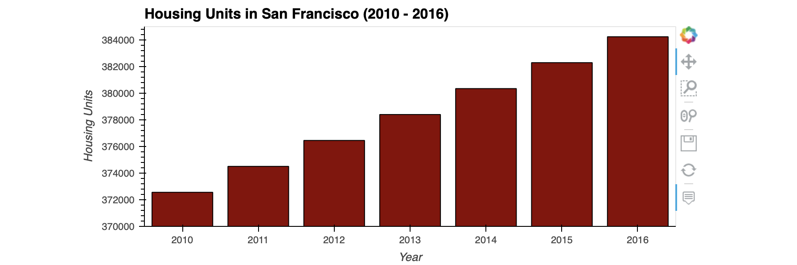
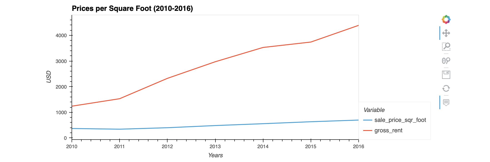
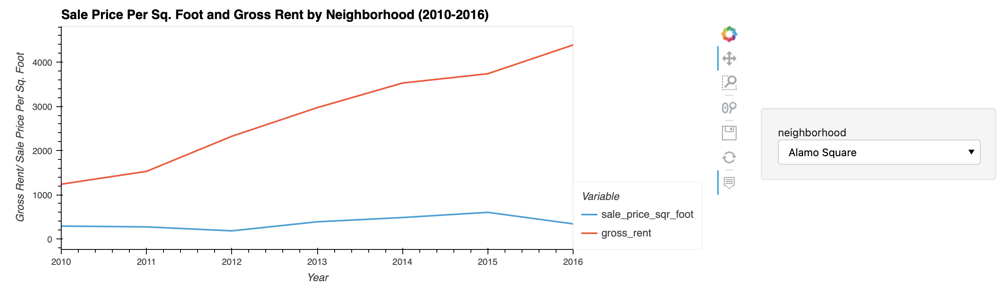
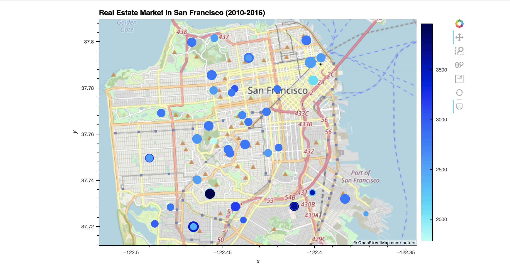

# *Real Estate Market in San Francisco*
---

**Welcome to my repository for the project on the real estate market in San Francisco. Please explore the codebase!** <br />

>“The best time to buy a home is always five years ago.” – Ray Brown
---
## Analytical Summary

This project visualizes and analyzes the real estate market in San Francisco. With minor changes, you can use this project to evaluate real estate market in the neighborhood of your interest. You will be able to calculate and analyze the housing units per year, the evolution of the average prices per square foot, compare the average prices by neighborhood and build an interactive map for your neighborhood.

---

## Technologies

This project leverages python 3.7 with the following packages:

* [pandas](https://pandas.pydata.org) - Library for fast manipulation with DataFrames, reading and writing csv files.

* [hvplot](https://hvplot.holoviz.org) - Library for interactive graphs.

* [pathlib](https://github.com/python/cpython/blob/3.10/Lib/pathlib.py) - Library for easy access to the filesystem paths.
---

## Installation Guide

Before running the application first install the following dependencies.

```python
  pip install pandas
  conda install -c pyviz hvplot
  pip install pathlib
```
---

## Usage

To use this project simply clone the repository and run the code **san_francisco_housing.ipynb** in JupyterLab or in VS Code.

---
## Graphs

First, we analyze the evolution of the housing units in San Francisco between years 2010 and 2016.



Second graph compares the dynamics for the gross rent and the sale prices per square foot in San Francisco between years 2010 and 2016.



Third graph displays the comparison between the gross rent and the sale prices for every neighborhood in San Francisco.



Finally, an interactive map combines all the information for a geospatial analysis concerning the real estate market.




---

## Contributors

Brought to you by Katerina Gawthorpe.

---

## License

MIT